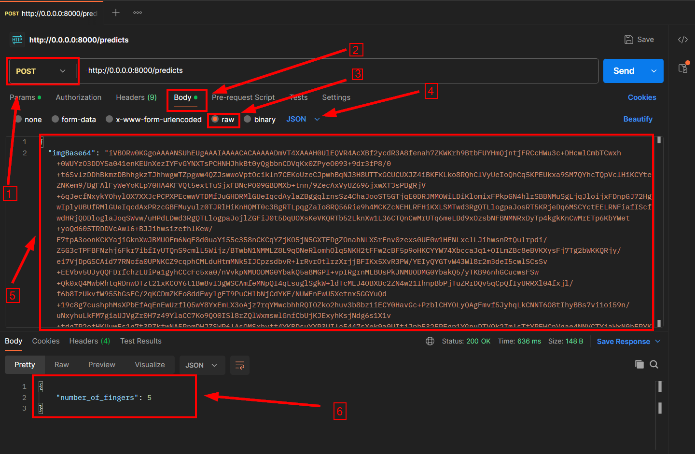

### Finger Digit Classification API (0–5)

This project provides an API for predicting the number of fingers shown in an image (from 0 to 5). It uses a convolutional neural network (CNN) trained on a hand gesture image dataset and serves predictions via FastAPI.

## Project Setup

### 1. Create a Virtual Environment

Make sure you are using **Python 3.12.5**.

```bash
python -m venv api_venv
```

### 2. Activate the Virtual Environment

- On **Windows**:

  ```bash
  .\api_venv\Scripts\activate
  ```

- On **Linux/macOS**:

  ```bash
  source api_venv/bin/activate
  ```

### 3. Install Required Libraries

Install all dependencies using `requirements.txt`.

```bash
pip install -r requirements.txt
```

## Train the Model

The model is trained using a convolutional neural network (CNN). You can train it manually using the Jupyter notebook provided:

```bash
notebooks/cnn_finger_classification_training.ipynb
```

Make sure the trained model (`finger_count_model1.h5`) is saved in the `src/models/` directory and is correctly referenced in `src/routes/predict.py`.

---

## Run the API Server

Start the FastAPI server using **uvicorn**:

```bash
uvicorn src.main:app --reload
```

Once started, navigate to:

## API Endpoint

### `POST /predicts`

This endpoint receives a base64-encoded image and returns the number of fingers detected.

To test the endpoint, use sample images from the Finger Digits 0–5 dataset on Kaggle - the same dataset used for model training.

Download and select any image from the dataset, then encode it to Base64.

#### Request Example

```json
{
  "imgBase64": "<base64_encoded_image>"
}
```

#### Response Example

```json
{
  "number_of_fingers": 3
}
```

### Using Postman

To test the endpoint via Postman:

1. Set request type to `POST`
2. Use URL: `http://0.0.0.0:8000/predicts`
3. In the **Body**, select `raw` and choose `JSON`
4. Paste your JSON with base64 image content.

### Screenshot Example



---

## Project Structure

```
project-root/
│
├── notebooks/
│   └── cnn_finger_classification_training.ipynb   # Notebook to train the model
│
├── src/
│   ├── main.py            # fastAPI entry point
│   ├── models/            # trained models
│   ├── routes/
│   │   └── predict.py     # /predicts endpoint logic
│   └── utils/
│       └── img_preprocessing.py   # image preprocessing function
│
├── requirements.txt
└── README.md
```
